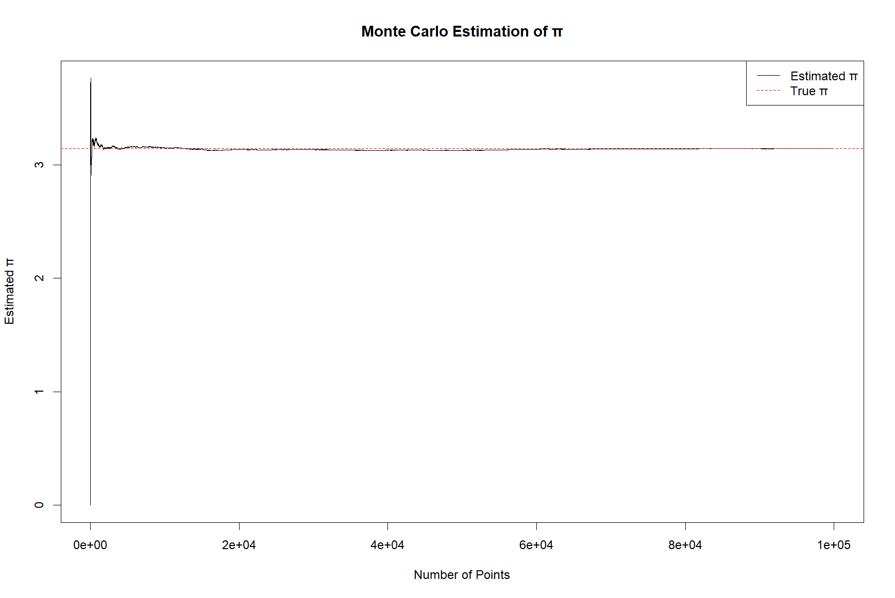

# Assignment 3

## Problem 1

**(1)** The probability that the computer will experience the next breakdown within the next 3 months is given by the cumulative distribution function (CDF) of the exponential distribution. For a rate parameter $\lambda = \frac{1}{5}$ per month:

$$
P(T \leq 3) = 1 - e^{-\lambda \cdot 3} = 1 - e^{-\frac{3}{5}}
$$

**Final Answer:**
$\boxed{1 - e^{-3/5}}$

---

**(2)** Using the **memoryless property** of the exponential distribution, the probability that the computer will not experience a breakdown in the next 4 months, given it had no breakdown in the past 4 months, is equivalent to the probability of no breakdown in a 4-month interval:

$$
P(T > 8 \mid T > 4) = P(T > 4) = e^{-\lambda \cdot 4} = e^{-\frac{4}{5}}
$$

**Final Answer:**
$\boxed{e^{-4/5}}$

## Problem 2

**(1)** To calculate the proportion of middle-class families (income between \$6,000 and \$12,000), we use the **standard normal distribution** with mean $\mu = 9000$ and standard deviation $\sigma = 2000$.

1. Calculate $Z$-scores:
   $$
   Z_{\text{lower}} = \frac{6000 - 9000}{2000} = -1.5, \quad Z_{\text{upper}} = \frac{12000 - 9000}{2000} = 1.5
   $$
2. Use the $Z$-table to find probabilities:
   $$
   P(Z \leq -1.5) \approx 0.0668, \quad P(Z \leq 1.5) \approx 0.9332
   $$
3. Subtract to find the proportion between \$6,000 and \$12,000:
   $$
   P(6000 < X < 12000) = 0.9332 - 0.0668 = 0.8664
   $$

**Final Answer:**  
$\boxed{86.64\%}$

---

**(2)** To find the income cutoff for the poorest 3%, we determine the $Z$-score corresponding to the 3rd percentile ($P = 0.03$).

1. From the $Z$-table, the $Z$-score for $P = 0.03$ is approximately $Z = -1.88$.
2. Convert the $Z$-score back to the income value:
   $$
   X = \mu + Z \cdot \sigma = 9000 + (-1.88)(2000) = 9000 - 3760 = 5240
   $$

**Final Answer:**  
$\boxed{\$5240}$ (rounded to the nearest dollar)

## Problem 3

Given $ X \sim \mathcal{N}(\mu, \sigma^2) $, we know the quadratic equation $ y^2 + 4y + X = 0 $ has no real roots when its discriminant is negative. The discriminant is:

$$
\Delta = 4^2 - 4(1)(X) = 16 - 4X.
$$

For no real roots, $\Delta < 0$:

$$
16 - 4X < 0 \implies X > 4.
$$

The problem states $ P(X > 4) = 0.5 $. In a normal distribution, $ P(X > \mu) = 0.5 $ because the distribution is symmetric about the mean. Thus, $ \mu = 4 $.

**Final Answer:**  
$\boxed{4}$

## Problem 4

**(1) PMF of $X$:**

The random variable $X$ represents the number of red balls picked before obtaining a green ball. The possible values of $X$ are $0, 1, 2$. The probabilities are calculated as follows:

- **$P(X = 0)$**: Probability of picking a green ball first.
  $$
  P(X = 0) = \frac{8}{10} = \frac{4}{5}
  $$

- **$P(X = 1)$**: Probability of picking red first, then green.
  $$
  P(X = 1) = \frac{2}{10} \cdot \frac{8}{9} = \frac{16}{90} = \frac{8}{45}
  $$

- **$P(X = 2)$**: Probability of picking both red balls first.
  $$
  P(X = 2) = \frac{2}{10} \cdot \frac{1}{9} = \frac{2}{90} = \frac{1}{45}
  $$

**PMF Summary:**
$$
P(X = x) = 
\begin{cases} 
\frac{4}{5} & \text{if } x = 0, \\
\frac{8}{45} & \text{if } x = 1, \\
\frac{1}{45} & \text{if } x = 2.
\end{cases}
$$

---

**(2) Expected Value and Variance:**

- **Expected Value ($E(X)$)**:
  $$
  E(X) = \sum x \cdot P(X = x) = 0 \cdot \frac{4}{5} + 1 \cdot \frac{8}{45} + 2 \cdot \frac{1}{45} = \frac{10}{45} = \frac{2}{9}
  $$

- **Variance ($Var(X)$)**:
  $$
  E(X^2) = \sum x^2 \cdot P(X = x) = 0^2 \cdot \frac{4}{5} + 1^2 \cdot \frac{8}{45} + 2^2 \cdot \frac{1}{45} = \frac{12}{45} = \frac{4}{15}
  $$
  $$
  Var(X) = E(X^2) - [E(X)]^2 = \frac{4}{15} - \left(\frac{2}{9}\right)^2 = \frac{4}{15} - \frac{4}{81} = \frac{88}{405}
  $$

**Final Answers:**  
- **$E(X)$**: $\boxed{\dfrac{2}{9}}$  
- **$Var(X)$**: $\boxed{\dfrac{88}{405}}$  

## Problem 5

**(1) Probability of Falling Inside the Unit Circle:**

The unit circle has radius $1$ and area $\pi$. The square $[-1,1] \times [-1,1]$ has side length $2$ and area $4$. The probability that a random point $(X,Y)$ falls inside the unit circle is the ratio of the circle’s area to the square’s area:

$$
P(X^2 + Y^2 \leq 1) = \frac{\pi}{4}.
$$

**Final Answer:**  
$\boxed{\dfrac{\pi}{4}}$

---

**(2) R Code for Estimating $\pi$ and Convergence Plot:**



```r
set.seed(20250330)
n <- 100000
x <- runif(n, -1, 1)
y <- runif(n, -1, 1)
inside <- (x^2 + y^2) <= 1
cumulative_inside <- cumsum(inside)
estimate <- 4 * cumulative_inside / (1:n)

plot(1:n, estimate, type = "l",
     xlab = "Number of Points", ylab = "Estimated π",
     main = "Monte Carlo Estimation of π")
abline(h = pi, col = "red", lty = 2)
legend("topright", legend = c("Estimated π", "True π"),
       col = c("black", "red"), lty = 1:2)
```

## Problem 6

See after the end of the document.

## Problem 7


