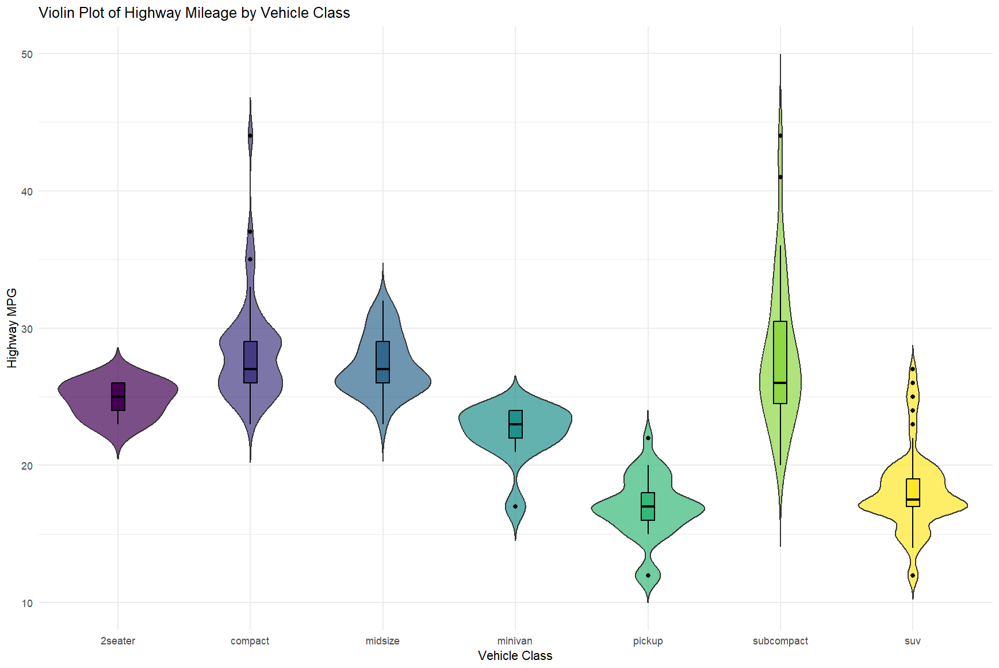
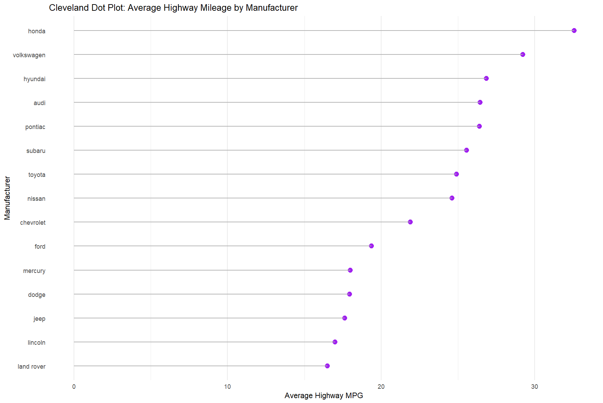

# Assignment 4

## Problem 1

- Example: Amazon’s Biased Recruiting Algorithm

### Background
Amazon developed an AI hiring tool to rank job applicants based on resumes collected over a 10-year period.

### Sampling Issues
The training data was mostly composed of resumes from male candidates, reflecting the tech industry's historical gender imbalance. As a result, the model learned that male-associated language and experiences correlated with successful hires.

### Incorrect Conclusions
The AI model began penalizing resumes with indicators of female identity (e.g., mentions of "women’s chess club" or all-women’s colleges). This resulted in the system favoring male candidates regardless of actual qualifications. Ultimately, the model’s outputs were deemed unreliable and the project was abandoned.

### Reflections
- **Watch for Historical Bias**: Training on biased past data can perpetuate discrimination.
- **Audit Feature Importance**: Regular review of what the model is learning helps catch unfair associations.
- **Human Oversight Is Critical**: Human judgment helped identify and stop a flawed automated system.

---

### Final Thoughts
Both examples underscore the same key lesson: **Unrepresentative sampling in AI leads to biased and often harmful conclusions.** It's essential to train and evaluate models on data that reflect the real-world population they aim to serve.


## Problem 2

### 1. Violin Plot
**Introduction**:
A **violin plot** combines a box plot and a kernel density plot. It displays the distribution of numerical data across categories, showing the density (width) and quartiles (central line and box). It is useful for comparing distributions and identifying multimodal data.

**R Code**:
```r
library(ggplot2)

# Violin plot of highway mileage (hwy) by vehicle class
ggplot(mpg, aes(x = class, y = hwy, fill = class)) +
  geom_violin(trim = FALSE, alpha = 0.7) +
  geom_boxplot(width = 0.1, color = "black") +
  scale_fill_viridis_d() +
  labs(
    title = "Violin Plot of Highway Mileage by Vehicle Class",
    x = "Vehicle Class",
    y = "Highway MPG"
  ) +
  theme_minimal() +
  theme(legend.position = "none")
```

**Screenshot**:



---

### 2. Cleveland Dot Plot
**Introduction**:
A **Cleveland dot plot** uses horizontal markers (dots) to compare numeric values across categories. It is more readable than bar charts for small to medium datasets, as it reduces visual clutter and emphasizes differences through position.

**R Code**:
```r
library(ggplot2)
library(dplyr)

# Calculate average highway mileage by manufacturer
avg_hwy <- mpg %>%
  group_by(manufacturer) %>%
  summarize(mean_hwy = mean(hwy, na.rm = TRUE)) %>%
  arrange(mean_hwy) %>%
  mutate(manufacturer = factor(manufacturer, levels = manufacturer))

# Cleveland dot plot
ggplot(avg_hwy, aes(x = mean_hwy, y = manufacturer)) +
  geom_point(color = "purple", size = 3) +
  geom_segment(
    aes(x = 0, xend = mean_hwy, y = manufacturer, yend = manufacturer),
    color = "gray70"
  ) +
  labs(
    title = "Cleveland Dot Plot: Average Highway Mileage by Manufacturer",
    x = "Average Highway MPG",
    y = "Manufacturer"
  ) +
  theme_minimal() +
  theme(panel.grid.major.y = element_blank())
```

**Screenshot**:




## Problem 3

### (1) Sample Mean, Variance, and Standard Deviation

- **Sample Mean**:
$$
\bar{x} = \frac{\sum x_i}{n} = \frac{1447}{30} \approx \boxed{48.23}
$$

- **Sample Variance**:
$$
s^2 = \frac{\sum x_i^2 - \frac{(\sum x_i)^2}{n}}{n-1} = \frac{90185 - \frac{2093809}{30}}{29} \approx \boxed{703.15}
$$

- **Sample Standard Deviation**:
$$
s = \sqrt{s^2} \approx \sqrt{703.15} \approx \boxed{26.52}
$$

---

### (2) Sample Median, Quartiles, and IQR

**Sorted Data**:
`9, 15, 19, 22, 24, 25, 30, 34, 35, 35, 36, 36, 37, 38, 42, 43, 46, 48, 54, 55, 56, 56, 59, 62, 69, 70, 82, 82, 89, 139`

- **Median**:
$$
\text{Median} = \frac{42 + 43}{2} = \boxed{42.5}
$$

- **Lower Quartile (Q1)**:
Median of the first 15 values:
$$
Q1 = \boxed{34}
$$

- **Upper Quartile (Q3)**:
Median of the last 15 values:
$$
Q3 = \boxed{59}
$$

- **Interquartile Range (IQR)**:
$$
\text{IQR} = Q3 - Q1 = 59 - 34 = \boxed{25}
$$

---

### (3) Outlier Detection

- **Lower Fence**:
$$
Q1 - 1.5 \times \text{IQR} = 34 - 37.5 = -3.5
$$

- **Upper Fence**:
$$
Q3 + 1.5 \times \text{IQR} = 59 + 37.5 = 96.5
$$

- **Outliers**:
Values outside $[-3.5, 96.5]$:
$$
\boxed{139}
$$

## Problem 4

### (1) Unbiasedness of $ \hat{\theta}_1 = a\bar{X} + b\bar{Y} $

**Proof:**
Since $ \bar{X} $ and $ \bar{Y} $ are sample means from the same population with mean $ \theta_1 $, we have:
$$
\mathbb{E}[\bar{X}] = \theta_1 \quad \text{and} \quad \mathbb{E}[\bar{Y}] = \theta_1.
$$
For the estimator $ \hat{\theta}_1 = a\bar{X} + b\bar{Y} $, its expectation is:
$$
\mathbb{E}[\hat{\theta}_1] = a\mathbb{E}[\bar{X}] + b\mathbb{E}[\bar{Y}] = a\theta_1 + b\theta_1 = \theta_1(a + b).
$$
Given the constraint $ a + b = 1 $:
$$
\mathbb{E}[\hat{\theta}_1] = \theta_1 \cdot 1 = \theta_1.
$$
Thus, $ \hat{\theta}_1 $ is an **unbiased estimator** of $ \theta_1 $.
**Conclusion:**
$$
\boxed{\mathbb{E}[\hat{\theta}_1] = \theta_1}.
$$

---

### (2) Minimizing the Variance of $ \hat{\theta}_1 $

#### Variance Expression
The variance of $ \hat{\theta}_1 $ is:
$$
\text{Var}(\hat{\theta}_1) = a^2\text{Var}(\bar{X}) + b^2\text{Var}(\bar{Y}.
$$
Since $ \text{Var}(\bar{X}) = \frac{\theta_2}{n} $ and $ \text{Var}(\bar{Y}) = \frac{\theta_2}{m} $, we substitute:
$$
\text{Var}(\hat{\theta}_1) = \theta_2\left(\frac{a^2}{n} + \frac{b^2}{m}\right).
$$

#### Optimization Under Constraint
We minimize $ \text{Var}(\hat{\theta}_1) $ subject to $ a + b = 1 $.

Let $ b = 1 - a $. Substitute into the variance:
$$
\text{Var}(\hat{\theta}_1) = \theta_2\left(\frac{a^2}{n} + \frac{(1 - a)^2}{m}\right).
$$
Take the derivative with respect to $ a $:
$$
\frac{d}{da}\text{Var}(\hat{\theta}_1) = \theta_2\left(\frac{2a}{n} - \frac{2(1 - a)}{m}\right).
$$
Set the derivative to zero:
$$
\frac{2a}{n} = \frac{2(1 - a)}{m} \implies \frac{a}{n} = \frac{1 - a}{m} \implies a = \frac{n}{n + m}.
$$
Thus, $ b = 1 - a = \frac{m}{n + m} $.

**Conclusion:**
The variance-minimizing weights are:
$$
a = \boxed{\frac{n}{n + m}}, \quad b = \boxed{\frac{m}{n + m}}.
$$
This corresponds to weighting inversely proportional to the variances of $ \bar{X} $ and $ \bar{Y} $.

## Problem 5

### (1) Moment Estimator of $\theta$

The first moment (mean) of $ X $ is:

$$
E[X] = \int_0^1 x \cdot \theta(1 - x)^{\theta - 1} \, dx.
$$

Substitute $ u = 1 - x $, $ du = -dx $, and adjust limits:

$$
E[X] = \theta \int_0^1 (1 - u)u^{\theta - 1} \, du = \theta \left[ \int_0^1 u^{\theta - 1} \, du - \int_0^1 u^\theta \, du \right].
$$

Evaluate the integrals:

$$
\int_0^1 u^{\theta - 1} \, du = \frac{1}{\theta}, \quad \int_0^1 u^\theta \, du = \frac{1}{\theta + 1}.
$$

Thus:

$$
E[X] = \theta \left( \frac{1}{\theta} - \frac{1}{\theta + 1} \right) = \frac{1}{\theta + 1}.
$$

Let $ \bar{X} = \frac{1}{n} \sum_{i=1}^n X_i $. Solve for $\theta$:

$$
\frac{1}{\theta + 1} = \bar{X} \implies \theta = \frac{1}{\bar{X}} - 1.
$$

$$
\hat{\theta}_{\text{ME}} = \boxed{\frac{1}{\bar{X}} - 1}.
$$

---

### (2) Maximum Likelihood Estimator (MLE) of $\theta$

$$
L(\theta) = \prod_{i=1}^n \theta(1 - X_i)^{\theta - 1}.
$$

$$
\ln L(\theta) = n \ln \theta + (\theta - 1) \sum_{i=1}^n \ln(1 - X_i).
$$

First derivative:
$$
\frac{d}{d\theta} \ln L(\theta) = \frac{n}{\theta} + \sum_{i=1}^n \ln(1 - X_i).
$$
Set derivative to zero:
$$
\frac{n}{\theta} + \sum_{i=1}^n \ln(1 - X_i) = 0 \implies \theta = -\frac{n}{\sum_{i=1}^n \ln(1 - X_i)}.
$$

Second derivative:
$$
\frac{d^2}{d\theta^2} \ln L(\theta) = -\frac{n}{\theta^2} < 0 \quad (\text{concave, so maximum}).
$$

**MLE:**
$$
\hat{\theta}_{\text{MLE}} = \boxed{-\frac{n}{\sum_{i=1}^n \ln(1 - X_i)}}.
$$

## Problem 6

### **Critical $Z$-Value**
For a 90% confidence interval, the critical $Z$-value (two-tailed) is:
$$
Z_{\alpha/2} = Z_{0.05} = 1.645
$$

$$
\text{Standard Error} = \frac{\sigma}{\sqrt{n}} = \frac{5}{\sqrt{64}} = \frac{5}{8} = 0.625
$$

$$
\text{Margin of Error} = Z_{\alpha/2} \cdot \text{Standard Error} = 1.645 \times 0.625 = 1.028
$$

$$
\text{Confidence Interval} = \bar{x} \pm \text{Margin of Error} = 42 \pm 1.028
$$

$$
\implies (42 - 1.028, \ 42 + 1.028) = \boxed{(40.97, \ 43.03)}
$$

---

**Interpretation**: We are 90% confident that the true population mean installation time lies between **40.97 minutes** and **43.03 minutes**.

## Problem 7

### (1) 95% Confidence Interval for Defective Proportion

**Critical $Z$-Value** (95% confidence):
$$
Z_{\alpha/2} = 1.96
$$

$$
\text{SE} = \sqrt{\frac{\hat{p}(1 - \hat{p})}{n}} = \sqrt{\frac{0.12 \times 0.88}{200}} \approx 0.023
$$

$$
\text{ME} = Z_{\alpha/2} \times \text{SE} = 1.96 \times 0.023 \approx 0.045
$$

$$
\hat{p} \pm \text{ME} = 0.12 \pm 0.045 \implies \boxed{(0.075, \ 0.165)}
$$

---

### (2) Hypothesis Test for Factory Claim

**Factory Claim**: At most 10% defective ($p_0 = 0.10$).
**Test**: $H_0: p \leq 0.10$ vs. $H_1: p > 0.10$ ($\alpha = 0.05$).

**Test Statistic**:
$$
Z = \frac{\hat{p} - p_0}{\sqrt{\frac{p_0(1 - p_0)}{n}}} = \frac{0.12 - 0.10}{\sqrt{\frac{0.10 \times 0.90}{200}}} \approx \frac{0.02}{0.021} \approx 0.943
$$

**Critical $Z$-Value** (one-tailed, $\alpha = 0.05$):
$$
Z_{\alpha} = 1.645
$$

**Conclusion**:
Since $Z = 0.943 < Z_{\alpha} = 1.645$, we **fail to reject $H_0$**.
There is insufficient evidence at the 5% significance level to disprove the factory’s claim.

**Final Answer**:
$$
\boxed{\text{No, we do not have sufficient evidence to reject the factory's claim.}}
$$